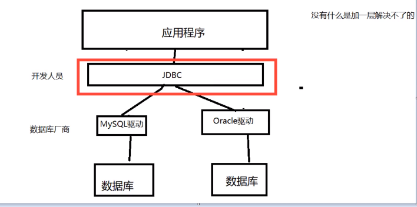
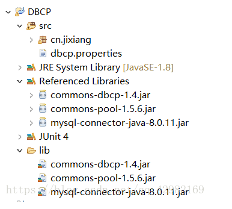
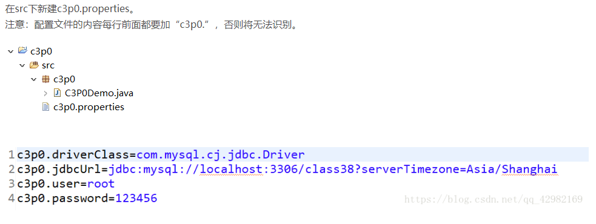
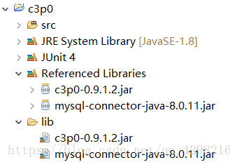
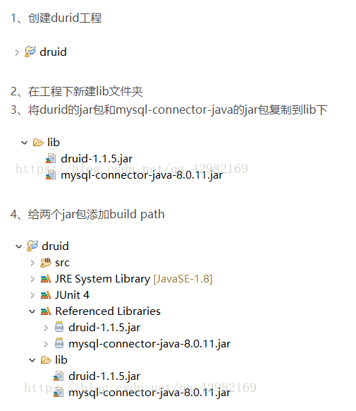

# JDBC




## 1. 简介

Sun公司为了简化开发人员的（对数据库统一）的操作，提供了一个（java操作数据库的）规范，俗称JDBC。

这些规范的实现由具体的厂商去做。

对于开发人员来说，只需要掌握JDBC接口即可


## 2. 第一个JDBC程序

```java
package com.zhuuu;

import java.sql.*;

public class FirstJDBC {
    public static void main(String[] args) throws ClassNotFoundException, SQLException {
        //1.加载驱动
        Class.forName("com.mysql.jdbc.Driver");

        //2.用户信息和url
        String url = "jdbc:mysql://127.0.0.1:3306/jdbcstudy?&useSSL=false&serverTimezone=UTC";
        String username = "root";
        String password = "123456";

        //3.连接成功，数据库对象
        Connection connection = DriverManager.getConnection(url, username, password);

        //4.执行SQL对象 执行SQL的对象
        Statement statement = connection.createStatement();

        //5.执行SQL的对象，去执行SQL,可能存在结果，查看返回结果
        String sql = "select * from student";

        ResultSet resultSet = statement.executeQuery(sql); // 结果集中封装了所有查询的结果

        while (resultSet.next()){
            System.out.println("id=" + resultSet.getObject("id"));
            //System.out.println("id=" + resultSet.getObject("id"));
            //System.out.println("id=" + resultSet.getObject("id"));

        }
        //6.释放连接
        resultSet.close();
        statement.close();
        connection.close();
    }
}
```

步骤总结：

1. 加载驱动
2. 连接数据库DriverManger
3. 获取执行sql的对象 statement**（不安全的）**
4. 获得返回的结果集**（ResultSet）**
5. 释放连接

> DriverManger

```
Class.forName("com.mysql.jdbc.Driver"); //固定写法，加载驱动

Connection connection = DriverManager.getConnection(url, username, password); // connection代表数据库
//数据库设置自动提交
//事务提交
//事务回滚
connetion.rollback();
```

> url

```
String url = "jdbc:mysql://localhost:3306/mybatisuserUnicode=true&characterEncoding=utf8&useSSL=true";
```

> Statement 执行SQL对象

```
String sql = "需要的sql语句";

statement.executeQuery(sql); //查询操作返回ResultSet
statement.execute(sql); // 执行任何sql
statement.executeUpdate(sql);// 更新，插入，删除，都是用这个，返回一个受影响的行数
```

> ResultSet 查询的结果集：封装了所有的查询结果
>
> resultSet.getObject();

> 释放资源必须做：
>
> ```
> resultSet.close();
> statement.close();
> connection.close(); // 尤其耗资源
> ```

### 2.1 编写统一工具类

```
package com.zhuuu.utils;

import java.io.IOException;
import java.io.InputStream;
import java.sql.*;
import java.util.Date;
import java.util.Properties;

public class JdbcUtils {

    private static String driver = null;
    private static String url = null;
    private static String username = null;
    private static String password = null;


    static {
        try {
            InputStream in = JdbcUtils.class.getClassLoader().getResourceAsStream("db.properties");
            Properties properties = new Properties();
            properties.load(in);

            driver = properties.getProperty("driver");
            url = properties.getProperty("url");
            username = properties.getProperty("username");
            password = properties.getProperty("password");

            //1.驱动只要加载一次
            Class.forName(driver);

        } catch (IOException e) {
            e.printStackTrace();
        } catch (ClassNotFoundException e) {
            e.printStackTrace();
        }
    }
    //获取链接
    public static Connection getConnection() throws SQLException {
        return DriverManager.getConnection(url, username, password);
    }

    //释放资源
    public static void release(Connection conn, Statement st, ResultSet rs){
        if(rs != null){
            try {
                rs.close();
            } catch (SQLException e) {
                e.printStackTrace();
            }
        }
        if (st != null){
            try {
                st.close();
            } catch (SQLException e) {
                e.printStackTrace();
            }
        }
        if (conn != null){
            try {
                conn.close();
            } catch (SQLException e) {
                e.printStackTrace();
            }
        }
    }
}
```

### 2.2 编写db.properties

```
driver=com.mysql.jdbc.Driver
url = jdbc:mysql://localhost:3306/?useUnicode=true&characterEncoding=UTF-8&useJDBCCompliantTimezoneShift=true&useLegacyDatetimeCode=false&serverTimezone=UTC
username=root
password=123456
```

==注意：编写db.properties时，不需要双引号和分号，否则会报错==


### 2.3 测试增删改查

1. **测试插入(insert)**

```
package com.zhuuu.JdbcTest;

import com.zhuuu.utils.JdbcUtils;

import java.sql.Connection;
import java.sql.ResultSet;
import java.sql.SQLException;
import java.sql.Statement;

public class TestInsert {
    public static void main(String[] args) {
        Connection conn = null;
        Statement  st = null;
        ResultSet  rs = null;

        try {
            //获取数据库连接
            Connection connection = JdbcUtils.getConnection();
            //获取SQL执行对象
            st = conn.createStatement();

            String sql = "insert into school.teacher(id,`name`) values('2','徐老师')";

            int i = st.executeUpdate(sql);
            if (i > 0) System.out.println("插入表成功！");

        } catch (SQLException e) {
            e.printStackTrace();
        }finally {
            JdbcUtils.release(conn,st,rs);
        }
    }
}
```

1. **测试删除（delete）**

```
package com.zhuuu.JdbcTest;

import com.zhuuu.utils.JdbcUtils;

import java.sql.Connection;
import java.sql.ResultSet;
import java.sql.SQLException;
import java.sql.Statement;

public class TestDelete {
    public static void main(String[] args) {
        Connection conn = null;
        Statement st = null;
        ResultSet rs = null;

        try {
            //获取数据库连接
            Connection connection = JdbcUtils.getConnection();
            //获取SQL执行对象
            st = conn.createStatement();

            String sql = "需要删除的内容";

            int i = st.executeUpdate(sql);
            if (i > 0) System.out.println("插入表成功！");

        } catch (SQLException e) {
            e.printStackTrace();
        }finally {
            JdbcUtils.release(conn,st,rs);
        }
    }
}
```

1. **测试更新（update）**

```
package com.zhuuu.JdbcTest;

import com.zhuuu.utils.JdbcUtils;

import java.sql.Connection;
import java.sql.ResultSet;
import java.sql.SQLException;
import java.sql.Statement;

public class TestUpdate {
    public static void main(String[] args) {
        Connection conn = null;
        Statement st = null;
        ResultSet rs = null;

        try {
            //获取数据库连接
            Connection connection = JdbcUtils.getConnection();
            //获取SQL执行对象
            st = conn.createStatement();

            String sql = "需要更新的的内容";

            int i = st.executeUpdate(sql);
            if (i > 0) System.out.println("插入表成功！");

        } catch (SQLException e) {
            e.printStackTrace();
        }finally {
            JdbcUtils.release(conn,st,rs);
        }
    }

}
```

1. **执行查询（Query）**

```
package com.zhuuu.JdbcTest;

import com.zhuuu.utils.JdbcUtils;

import java.sql.Connection;
import java.sql.ResultSet;
import java.sql.SQLException;
import java.sql.Statement;

public class TestQuery {
    public static void main(String[] args) {
        Connection conn = null;
        Statement  st = null;
        ResultSet  rs = null;

        try {
            Connection connection = JdbcUtils.getConnection();
            st = conn.createStatement();

            //SQL
            String sql = "select * from school.teacher where id=1";
            rs = st.executeQuery(sql);
            
            if (rs.next()){
                System.out.println(rs.getString("name"));
            }


        } catch (SQLException e) {
            e.printStackTrace();
        }finally {
            JdbcUtils.release(conn,st,rs);
        }
    }
}
```

## 3. SQL注入的问题

1. 前期准备工作:首先，创建一张试验用的数据表：

```
CREATE TABLE `users` (
`id` int(11) NOT NULL AUTO_INCREMENT,
`username` varchar(64) NOT NULL,
`password` varchar(64) NOT NULL,
`email` varchar(64) NOT NULL,
PRIMARY KEY (`id`),
UNIQUE KEY `username` (`username`)
) ENGINE=MyISAM AUTO_INCREMENT=3 DEFAULT CHARSET=latin1;
```

添加一条测试记录：

```
INSERT INTO users (username,password,email)
VALUES('MarcoFly',md5('test'),'marcofly@test.com');
```

创建前台登录页面：

```
<html>
<head>
<title>Sql注入演示</title>
<meta http-equiv="content-type" content="text/html;charset=utf-8">
</head>
<body >
<form action="validate.php" method="post">
<fieldset >
<legend>Sql注入演示</legend>
<table>
<tr>
<td>用户名：</td><td><input type="text" name="username"></td>
</tr>
<tr>
<td>密  码：</td><td><input type="text" name="password"></td>
</tr>
<tr>
<td><input type="submit" value="提交"></td><td><input type="reset" value="重置"></td>
</tr>
</table>
</fieldset>
</form>
</body>
</html>
```

附上效果图：


- 当用户点击提交按钮的时候，将会把表单数据提交给validate.php页面，validate.php页面用来判断用户输入的用户名和密码有没有都符合要求（这一步至关重要，也往往是SQL漏洞所在）

```
!                                         <!--前台和后台对接-->
<html>
<head>
<title>登录验证</title>
<meta http-equiv="content-type" content="text/html;charset=utf-8">
</head>
<body>
<?php
$conn=@mysql_connect("localhost",'root','') or die("数据库连接失败！");;
mysql_select_db("injection",$conn) or die("您要选择的数据库不存在");
$name=$_POST['username'];
$pwd=$_POST['password'];
$sql="select * from users where username='$name' and password='$pwd'";
$query=mysql_query($sql);
$arr=mysql_fetch_array($query);
if(is_array($arr)){
header("Location:manager.php");
}else{
echo "您的用户名或密码输入有误，<a href=\"Login.php\">请重新登录！</a>";
}
?>
</body>
</html>
```

- 注意到了没有，我们直接将用户提交过来的数据(用户名和密码)直接拿去执行，**并没有实现进行特殊字符过滤，待会你们将明白，这是致命的。**
- 代码分析：如果，用户名和密码都匹配成功的话，将跳转到管理员操作界面(manager.php)，不成功，则给出友好提示信息。
  登录成功的界面：


登录失败的提示：


到这里，前期工作已经做好了，**接下来将展开我们的重头戏：SQL注入**

1. **构造SQL语句**

- 填好正确的用户名(marcofly)和密码(test)后，点击提交，将会返回给我们“欢迎管理员”的界面。
- 因为根据我们提交的用户名和密码被合成到SQL查询语句当中之后是这样的：
  `select * from users where username='marcofly' and password=md5('test')`
- 很明显，用户名和密码都和我们之前给出的一样，肯定能够成功登陆。但是，如果我们输入一个错误的用户名或密码呢？很明显，肯定登入不了吧。恩，正常情况下是如此，但是对于有SQL注入漏洞的网站来说，**只要构造个特殊的“字符串”，照样能够成功登录。**

**比如：在用户名输入框中输入:`'' or 1=1#`,密码随便输入，这时候的合成后的SQL查询语句为：**
**`select \* from users where username='' or 1=1#' and password=md5('')`**
**语义分析：“#”在mysql中是注释符，这样井号后面的内容将被mysql视为注释内容，这样就不会去执行了，换句话说，以下的两句sql语句等价：**

```
select * from users where username='' or 1=1#' and password=md5('')
```

**等价于**

```
select* from users where usrername='' or 1=1
```

- **因为1=1永远是都是成立的**，**即where子句总是为真，将该sql进一步简化之后，等价于如下select语句：**
- `select * from users`

**没错，该sql语句的作用是检索users表中的所有字段**

再次构造语句：

```
select * from users where username='admin'#' and password=md5('')
```

等价于

```
select * from users where username='admin'
```

这样即可能不用输入密码登入上去的。

数据库就会错认为不用用户名既可以登入，**绕过后台的验证，已到达注入的目的。**

同样利用了**SQL语法的漏洞。**

## 4. PrepareStatement

作用：ParpareStatement 可以防止SQL注入，效率更高

1. 测试插入

```
package com.zhuuu.prepareState;

import com.zhuuu.utils.JdbcUtils;

import java.sql.Connection;
import java.sql.PreparedStatement;
import java.sql.SQLException;

public class TestInsert {
    public static void main(String[] args) {
        Connection conn = null;
        PreparedStatement st = null;


        try {
            JdbcUtils.getConnection();

            //和之前的区别
            String sql = "insert into school.teacher(id,`name`) values(?,?)";

            st= conn.prepareStatement(sql); // 预编译sql 但不执行

            //手动给参数赋值
            st.setInt(1,4);
            st.setString(2,"朱酱酱");

            //执行
            int i = st.executeUpdate();
            if (i>0){
                System.out.println("插入成功");
            }


        } catch (SQLException e) {
            e.printStackTrace();
        }finally {
            JdbcUtils.release(conn,st,null);
        }
    }
}
```

1. 测试删除

```
package com.zhuuu.prepareState;

import com.zhuuu.utils.JdbcUtils;

import java.sql.Connection;
import java.sql.PreparedStatement;
import java.sql.SQLException;

public class TestDelete {
    public static void main(String[] args) {
        Connection conn = null;
        PreparedStatement st = null;


        try {
            JdbcUtils.getConnection();

            //区别
            String sql = "delete from school.teacher where id = ?";

            st= conn.prepareStatement(sql); // 预编译sql 但不执行

            //手动给参数赋值
            st.setInt(1,4);

            //执行
            int i = st.executeUpdate();
            if (i>0){
                System.out.println("插入成功");
            }


        } catch (SQLException e) {
            e.printStackTrace();
        }finally {
            JdbcUtils.release(conn,st,null);
        }
    }
}
```

1. 测试更新

```
package com.zhuuu.prepareState;

import com.zhuuu.utils.JdbcUtils;

import java.sql.Connection;
import java.sql.PreparedStatement;
import java.sql.SQLException;

public class TestUpdate {
    public static void main(String[] args) {
        Connection conn = null;
        PreparedStatement st = null;


        try {
            JdbcUtils.getConnection();

            //区别
            String sql = "update .....";

            st= conn.prepareStatement(sql); // 预编译sql 但不执行

            //手动给参数赋值
            st.setInt(1,4);

            //执行
            int i = st.executeUpdate();
            if (i>0){
                System.out.println("插入成功");
            }


        } catch (SQLException e) {
            e.printStackTrace();
        }finally {
            JdbcUtils.release(conn,st,null);
        }
    }
}
```

1. 测试查询(完美防止sql注入)

**本质：防止sql注入的本质，把传递进来的参数当做字符，加入存在转义字符，比如’’会被直接转义**

```
fpackage com.zhuuu.prepareState;

import com.zhuuu.utils.JdbcUtils;

import java.sql.Connection;
import java.sql.PreparedStatement;
import java.sql.ResultSet;
import java.sql.SQLException;

public class TestQuery {
    public static void main(String[] args) {
        Connection conn = null;
        PreparedStatement st = null;


        try {
            JdbcUtils.getConnection();

            //区别
            String sql = "select * from school.result where id = ? and password = ?";

            st= conn.prepareStatement(sql); // 预编译sql 但不执行

            //手动给参数赋值
            st.setInt(1,4);

            //执行
            ResultSet rs = st.executeQuery();

            if (rs.next()){
                System.out.println(rs.getString("name"));
            }


        } catch (SQLException e) {
            e.printStackTrace();
        }finally {
            JdbcUtils.release(conn,st,null);
        }
    }
}
```

## 5. 事务

**一句话：要么都成功，要么都失败**

1. 原子性：要么都成功，要么都失败
2. 一致性：总数不变
3. 隔离性：多个进程互不干扰
4. 持久性：一旦提交就不可逆，持久化到数据库

隔离性的问题：

脏读：一个事务读取了另一个没有提交的事务

不可重复读：在同一个事务内，重复读取表中的数据，数据发生了改变

虚读（幻读）：在一个事务内，插入了新的数据

**JDBC模拟银行转账失败**

```
package com.zhuuu.prepareState;

import com.zhuuu.utils.JdbcUtils;

import java.sql.Connection;
import java.sql.PreparedStatement;
import java.sql.SQLException;

public class TestTransction {
    public static void main(String[] args) throws SQLException {
        Connection conn = null;
        PreparedStatement st = null;

        try {
            conn = JdbcUtils.getConnection();

            conn.setAutoCommit(false);//开启事务，关闭自动提交


            String sql1 = "update account set money = money + 100 where name ='A'";
            st = conn.prepareStatement(sql1);
            st.executeUpdate();

            int x = 1/0;
            System.out.println("===============");

            String sql2 = "update account set money = money - 100 where name ='B'";
            st = conn.prepareStatement(sql2);
            st.executeUpdate();


        } catch (SQLException e) {
            conn.rollback(); //失败就回滚
            e.printStackTrace();
        }finally {
            JdbcUtils.release(conn,st,null);
        }
    }
}
```

## 6. 数据库连接池

**池化技术**

#### Java三种连接池（druid、c3p0、dbcp）

以下参考链接：https://blog.csdn.net/qq_42982169/article/details/82181631?depth_1-utm_source=distribute.pc_relevant.none-task&utm_source=distribute.pc_relevant.none-task

### 6.1 DPCP



### 6.2 C3P0





### 6.3 Druid



